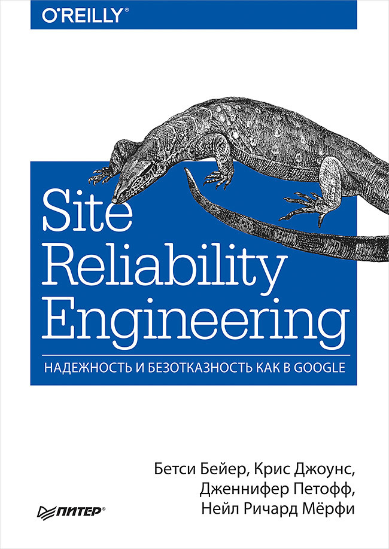

||Описание|
|:-:|:---|
||<b>Название: </b>Site Reliability Engineering. Надежность и безотказность как в Google <b>Автор:</b> Бейер Бетси, Джоунс Крис, Петофф Дженнифер, Мерфи Нейл Ричард <b>Год издания:</b> 2020 <b>Оценка:</b> 4/5|