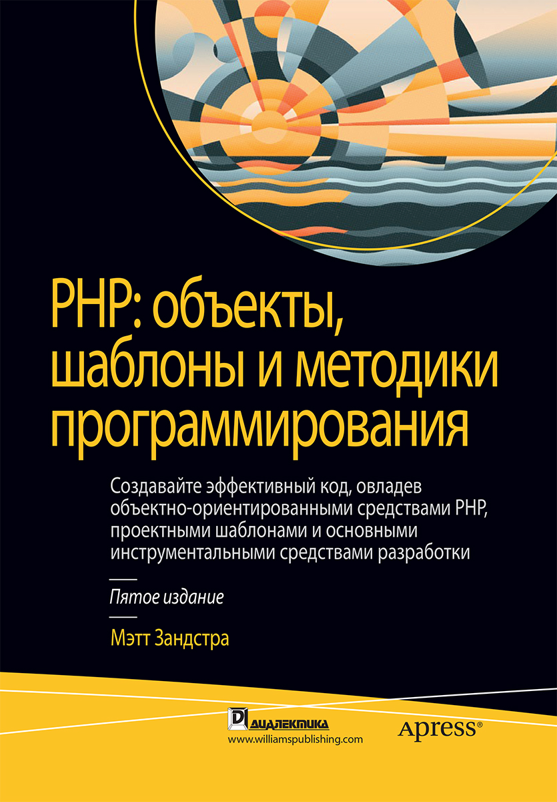

# PHP

## Начальный уровень
||Описание|Автор|Год издания|
|:-:|:---|:---|:---|
||PHP. Быстрый старт|Хопкинс Каллум|2014|

## Продвинутый уровень
||Описание|Автор|Год издания|
|:-:|:-|:-|:-|
||PHP. Объекты, шаблоны и методики программирования | Зандстра Мэт| 2019|