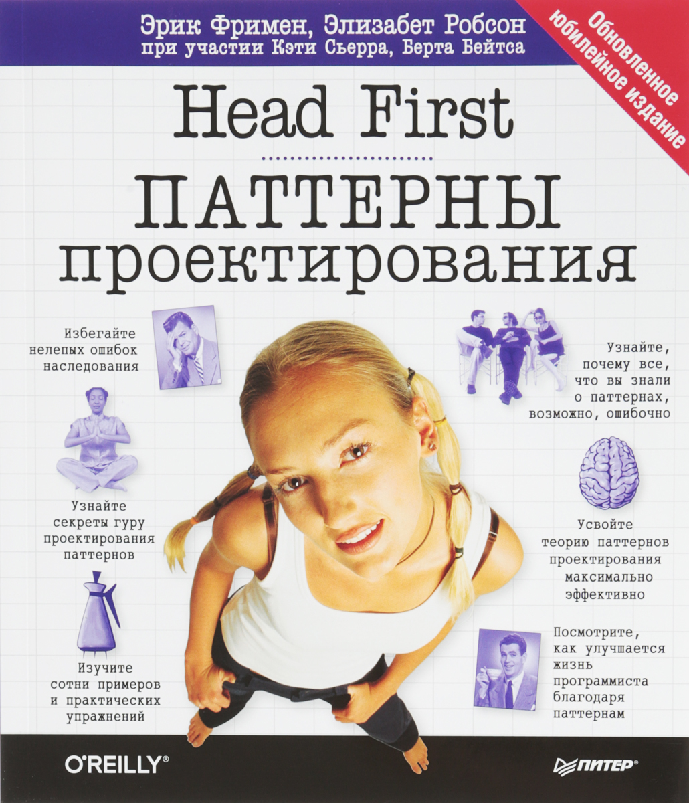

## Средний уровень
||Описание|
|:-:|:---|
||<b>Название: </b>Чистый код. Создание, анализ и рефакторинг <b>Автор:</b>Роберт Мартин <b>Год издания:</b> 2019 <b>Оценка:</b> 5/5|
||<b>Название: </b>Head First. Паттерны проектирования. Обновленное юбилейное издание <b>Автор:</b>Фримен Эрик, Робсон Элизабет <b>Год издания:</b> 2018 <b>Оценка:</b> 4/5|