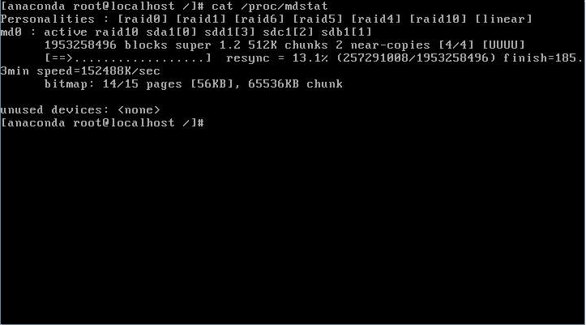

Создадим на каждом диске разделы для будущего массива c помощью fdisk. В качестве типа раздела следует указать fd (Linux RAID autodetect).

```bash
fdisk /dev/sdX
```

Собираем массив RAID 10 из созданных разделов с помощью команды:

```bash
mdadm --create --verbose /dev/md0 --level=10 --raid-devices=4 /dev/sda1 /dev/sdb1 /dev/sdc1 /dev/sdd1
```

```bash
cat /proc/mdstat
```

