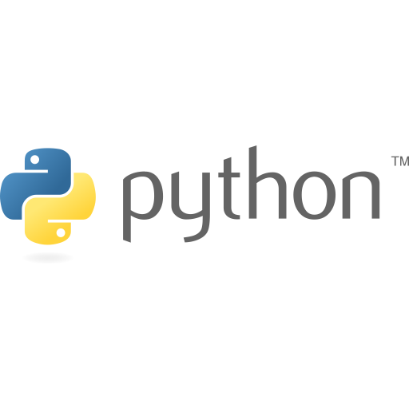

# Оглавление

## Development / Разработка

<table>
    <tr>
        <td align="center">
            <b>PHP</b>
        </td>
        <td align="center">
            <b>Python</b>
        </td>
        <td align="center">
            <b>Laravel</b>
        </td>    
    </tr>
    <tr>
        <td align="center">
            
        </td>
        <td align="center">
            
        </td>
        <td align="center">
                
        </td>
    </tr>
    <tr>
        <td>
        </td>
        <td>
        </td>
        <td>
            <a href="">Packets</a> 
            <a href="">Instructions</a> 
            <a href="">Troubleshooting</a>
        </td>
    </tr>
</table>

# Разработка / Development

* [Книги](Development/Books)
* [Полезные статьи из мира разработки](Development/Docs)
* [Golang_Packets](Javascript_Packets/Golang_Packets)
* [Javascript_Packets](Development/Javascript_Packets)
* [Laravel](Development/Laravel)
    * [Полезные статьи и документация по Laravel](/Development/Laravel/Documentation)
    * [Инструкции / Instructions](/Development/Laravel/Instructions)
    * [Заметки по решению проблем с Laravel](/Development/Laravel/Troubleshooting)
    * [Быстрая помощь](/Development/Laravel/QuickHelp)
* [Другое / Others](Development/Others)
* [PHP Пакеты / PHP Packets](/Development/PHP_Packets)
    - [Дополнительные инструкции](/Development/PHP_Packets/Instructions)
* [Python](Development/Python)
* [Regex](Development/Regex)
* [Шаблоны / Templates](Development/Templates)
* [Тестирование / Testing](Development/Testing)
* [Оформление / UI](Development/UI)
* [Полезные видео из мира разработки](Development/Videos)

# Devops

* [Bash](DevOps/Bash)
    * [Полезная документация](/DevOps/Bash/Documentation)
    * [Скрипты](/DevOps/Bash/Scripts)
    * [Troubleshooting](/DevOps/Bash/Troubleshooting)
* [Books](DevOps/Books)
* [CMDScript](DevOps/CMDScript)
* [Cron](DevOps/Cron)
* [Hosting](DevOps/Hosting)
* [Linux_Commands](DevOps/Linux_Commands)
* [Linux_Utils](DevOps/Linux_Utils)
* [Monitoring](DevOps/Monitoring)
* [Testing](DevOps/Testing)
* [Hardware](Hardware)

**[⬆ К оглавлению](#Оглавление)**